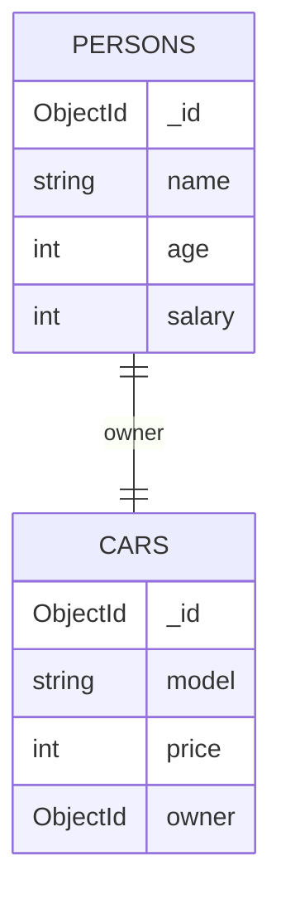
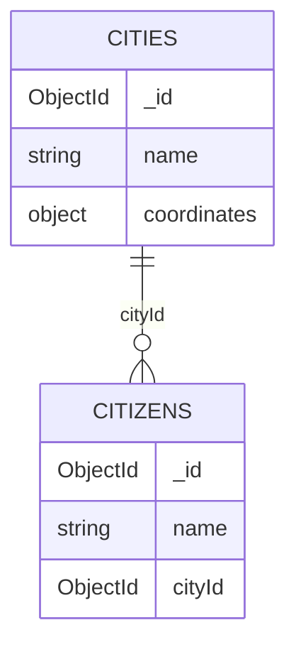
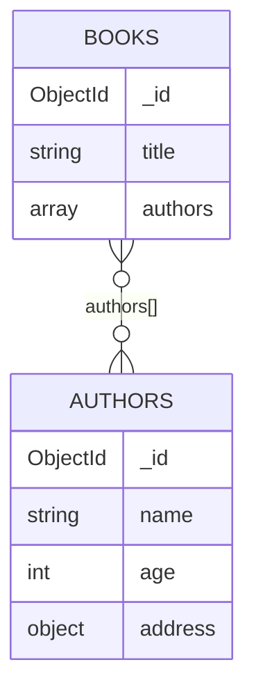

# Aula 3 - Relations no MongoDB

Modelagem de relacionamentos no MongoDB: quando **embarcar** (embedded documents) e quando **referenciar** (ObjectId), com exemplos de 1:1, 1:N e N:M.

> Baseado na aula *MongoDB: Modelagem & Schemas* do Prof. Jefté Goes.

## Sumário

- [Conceitos da aula](#conceitos-da-aula)
- [Embedded vs References](#embedded-vs-references)
- [1:1 - Um para Um](#11---um-para-um)
- [1:N - Um para Muitos](#1n---um-para-muitos)
- [N:M - Muitos para Muitos](#nm---muitos-para-muitos)
- [Regra prática para decidir](#regra-prática-para-decidir)
- [Como executar](#como-executar)
- [Estrutura da pasta](#estrutura-da-pasta)

---

## Conceitos da aula

**IDs únicos (`_id`)**
Todo documento no MongoDB precisa ter um campo `_id`. Se você não informar, o MongoDB gera um `ObjectId()` de 12 bytes automaticamente. Também é possível usar um valor próprio.

**Documentos incorporados (embedded)**
Guardam dados relacionados dentro do documento principal. Dispensam joins e têm ótimo desempenho quando os dados são lidos juntos. Ex.: o endereço dentro do perfil do cliente.

**Projeção (projection)**
Define quais campos voltam numa consulta, evitando trafegar o documento inteiro:

```js
db.patients.findOne({ name: "Jefté" }, { _id: 0, "diseaseSummary.diseases": 1 })
```

**Schema flexível**
O MongoDB não impõe um schema rígido: documentos da mesma collection podem ter estruturas diferentes. Isso permite evoluir o modelo sem migrações pesadas, mas nada impede de validar a estrutura com JSON Schema quando fizer sentido.

**Perguntas de arquitetura antes de modelar**

| Pergunta | O que ela define |
|---|---|
| Quais dados são necessários? | Os campos e como se relacionam |
| Onde o dado é consumido? | As collections e os agrupamentos de campos |
| Qual o tipo de exibição? | As consultas mais eficientes |
| Qual a frequência de leitura/escrita? | Se otimizamos para leitura rápida ou escrita sem duplicação |

**Leitura vs. escrita**

| Muitas consultas (read-heavy) | Muitas gravações (write-heavy) |
|---|---|
| Guardar o dado pronto no formato que o front precisa | Guardar o dado sem duplicação |
| Prioriza **documentos incorporados** | Prioriza **referências (ObjectId)** |
| Ex.: catálogo de produtos, páginas iniciais | Ex.: registros financeiros, pedidos, logs |

---

## Embedded vs References

| | Embedded (incorporado) | Reference (referência) |
|---|---|---|
| Onde fica o dado | Dentro do documento pai | Em outra collection, ligado por `ObjectId` |
| Leitura | 1 consulta traz tudo | Precisa de 2 consultas ou `$lookup` |
| Duplicação | Pode duplicar dados | Sem duplicação |
| Crescimento | Limitado a 16MB por documento | Cresce sem limite |
| Melhor para | Dados que "pertencem" ao pai | Entidades independentes / compartilhadas |

---

## 1:1 - Um para Um

### Exemplo #1 - Paciente ↔ Doença (embarcado)

O resumo de doenças pertence exclusivamente ao paciente e é lido junto com ele.

```js
db.patients.insertOne({
  name: "Jefté",
  age: 35,
  diseaseSummary: { diseases: ["cold", "broken leg"] }
})
```

### Exemplo #2 - Pessoa ↔ Carro (referência)

Pessoa e carro têm vida independente. O carro guarda o `_id` do dono.

```js
db.persons.insertOne({ name: "Jefté", age: 35, salary: 3000 })
db.cars.insertOne({ model: "BMW", price: 40000, owner: ObjectId("6aa9e2cee9c288ce1241317e") })
```



---

## 1:N - Um para Muitos

### Exemplo #3 - Tópico ↔ Respostas (embarcado)

As respostas só existem dentro do tópico de discussão.

```js
db.questionThreads.insertOne({
  creator: "Jefté",
  question: "How does that work?",
  answers: [{ text: "Like that." }, { text: "Thanks!" }]
})
```

### Exemplo #4 - Cidade ↔ Cidadãos (referência)

Uma cidade pode ter milhões de cidadãos. Embarcar todos estouraria o limite de **16MB** do documento, então cada cidadão aponta para a cidade.

```js
db.cities.insertOne({ name: "New York City", coordinates: { lat: 21, lng: 55 } })
db.citizens.insertMany([
  { name: "Jefté Goes",      cityId: ObjectId("5b98d6b44d01c52e1637a99f") },
  { name: "Brenno Salvador", cityId: ObjectId("5b98d6b44d01c52e1637a99f") }
])
```



---

## N:M - Muitos para Muitos

### Exemplo #5 - Clientes ↔ Produtos (embarcado)

O histórico de pedidos fica "congelado" dentro do cliente: título e preço do momento da compra.

```js
db.customers.insertOne({ name: "Jefté", age: 35 })
db.customers.updateOne({}, {
  $set: { orders: [{ title: "A Book", price: 12.99, quantity: 2 }] }
})
```

### Exemplo #6 - Livros ↔ Autores (array de referências)

Um livro tem vários autores e um autor escreve vários livros. O livro guarda um array de `ObjectId`.

```js
db.authors.insertMany([
  { name: "Jorge Amado",      age: 78, address: { street: "Bahia" } },
  { name: "Graciliano Ramos", age: 55, address: { street: "Rio de Janeiro" } }
])

db.books.updateOne({}, {
  $set: { authors: [ObjectId("5b98d9e44d01c52e1637a9a6"), ObjectId("5b98d9e44d01c52e1637a9a7")] }
})
```



### Lendo as referências com `$lookup`

```js
db.books.aggregate([
  { $lookup: { from: "authors", localField: "authors", foreignField: "_id", as: "authorsData" } }
])
```

---

## Regra prática para decidir

**Use embedded** quando os dados forem acessados juntos, houver forte relação de pertencimento, não forem compartilhados e o tamanho do documento estiver sob controle.

**Use references** quando os dados forem compartilhados entre várias entidades, tiverem vida independente, puderem crescer sem limite ou houver uma relação N:M complexa.

**Ajuste fino:** modele pensando no uso real do sistema e equilibre a taxa de leitura vs. escrita.

---

## Como executar

Pré-requisitos: MongoDB rodando localmente e o `mongosh` instalado.

**Opção 1 - Scripts prontos** (criam o banco `aula3_relations`, capturam os ids gerados e mostram o resultado com `$lookup`):

```bash
mongosh aula-03-relations/scripts/01-one-to-one.js
mongosh aula-03-relations/scripts/02-one-to-many.js
mongosh aula-03-relations/scripts/03-many-to-many.js
```

**Opção 2 - Comandos da aula**: abra o `mongosh` e cole os comandos de [`comandos-aula.js`](comandos-aula.js) um por um.

> Os `ObjectId` fixos nos exemplos são os que foram gerados na aula. Na sua base eles serão outros: copie o `_id` retornado pelo insert e substitua.

## Estrutura da pasta

```
aula-03-relations/
├── README.md              # teoria + exemplos
├── comandos-aula.js       # comandos exatamente como vistos em aula
└── scripts/
    ├── 01-one-to-one.js   # 1:1 - patients / persons + cars
    ├── 02-one-to-many.js  # 1:N - questionThreads / cities + citizens
    └── 03-many-to-many.js # N:M - customers / books + authors
```
